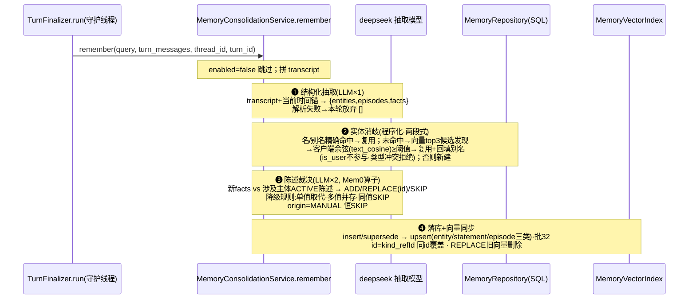
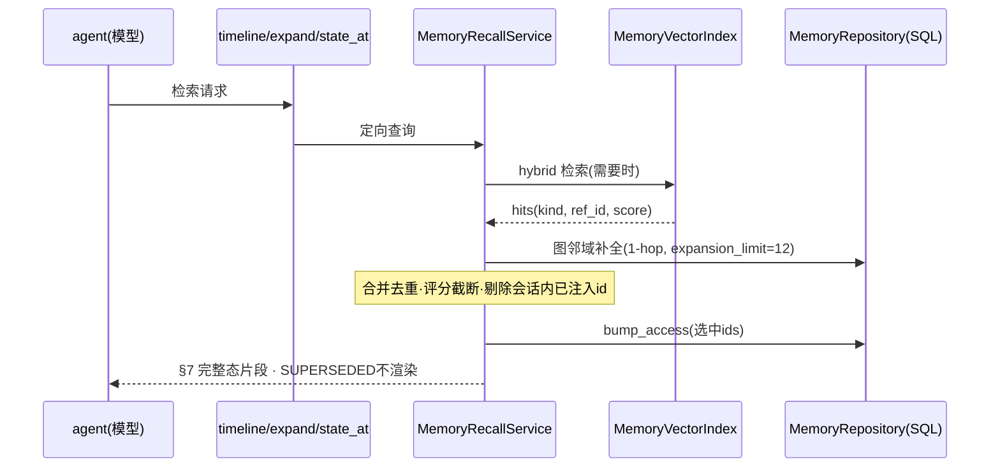

# 记忆系统 v2 设计定稿：《时-人-事-物》双层图谱

> 状态：**设计共识已达成**（2026-08-27，与作者逐轮确认：建模深度、存储选型、
> 作用域、遗忘机制、两级召回架构、渲染模板），并已对齐同日服务层重构
> （编排类 `AgenticService`→`ChatOrchestrator`；2026-08-30 语义升级正名回
> `AgenticService`、`chat`→`run`。后置处理抽提 `TurnFinalizer`、
> orchestration/domain 两层制、向量适配器归位领域层——提交 4bf10fb /
> bfedf60 / ae241e0）。实现按 §9 文件清单执行，前置阅读 `server/AGENTS.md`
> 「服务层两层制」。

## 1. 目标

跨会话记忆系统，具备两级检索能力：

- **快速回忆**：agent 开始会话前，依据用户新问题自动注入一段轻量记忆块
  （无需工具调用），让模型即刻知道"对方是谁、系统记得什么"。
- **深度回忆**：由 agent 按需多轮调用窄粒度检索工具（类 RAG 迭代），
  沿实体联系逐层还原事件的来龙去脉，直到自评上下文充分后作答。

## 2. 理论映射（设计依据速查）

| 认知原理 | 工程落点 |
| --- | --- |
| 情节/语义双记忆（Tulving 1972） | 双层模型：情节层 episode + 语义层 entity/statement |
| 系统巩固（睡眠重放，情节→语义提取） | 写路径巩固管线（结构化抽取→消歧→裁决→落库） |
| 遗忘曲线 + 提取练习效应 | 惰性衰减评分 + bump_access 召回强化，无后台任务 |
| 再巩固（唤起的记忆可被改写） | 冲突消解：SUPERSEDED 而非重复插入；MANUAL 陈述受保护 |
| 编码特异性（联系即检索通路） | 图扩散（expand 工具、1-hop 关联召回） |

业界参照：Mem0 的 ADD/REPLACE/SKIP 裁决算子；Zep/Graphiti 的双时间轴与
实体邻域扩展；Letta 的"情节原文有独立召回价值"。

## 3. 已锁定决策

1. **建模**：双层图谱式 —— 情节层（事）+ 语义层（人/物实体 + 三元组陈述），
   "时"以双时间轴贯穿所有对象。
2. **存储**：关系库（SQLModel；SQLite/PG 经 DatabaseFactory 透明切换）为
   事实源，Weaviate 为派生召回索引（事实源可随时 `rebuild_index()` 重建
   向量端）。不引入图数据库。
   - 图数据库再评估触发条件（任一满足重启讨论）：≥2 跳证据链推理成为需求；
     记忆规模达十万节点级并需要社区聚类摘要；多用户/多智能体共享记忆池。
3. **作用域**：~~单用户全局~~（v1 决策，2026-08-30 随用户模块引入而反转）。
   **现为用户级隔离**：entity/statement/episode 三表带 `user_id`
   （episode_link 经 episode 继承归属），读写路径经
   `MemoryRepository.for_user(uid)` 作用域视图强制过滤；向量侧每用户一个
   collection `Memory_{uid.hex}`。"用户"仍是标记 `is_user=True` 的特殊
   PERSON 实体，但**每用户一个**（consolidation `_ensure_user_entity` 在
   作用域内查找/创建），消歧合并永不参与被吞并的保护语义不变。
   图数据库再评估触发条件中的"多用户共享记忆池"指跨用户共享（仍非目标）。
4. **遗忘**：惰性衰减。数据不物理删除，长期不被召回的条目经评分自然沉底；
   每次被召回则 access_count+1 并刷新 last_accessed_at（提取练习强化）。
5. **召回架构**：快速/深度两级（§6）；管理侧能力（可视化/人工编辑）列为
   P1 分期（§11），但防再固护字段 `origin` 本版一并建模（§4）。
6. **分层落位**：遵循 AGENTS.md「服务层两层制」依赖箭头表——记忆逻辑主体
   留在 `components/memory`（被 agents 工具装配与编排收尾消费）；向量适配器
   归位领域侧 `services/domain/memory/vector_index.py`（镜像知识域先例，
   组件经合法 components→domain 边引用，不直触 `VectorStoreFactory`）。
   全部改动必须通过 `tests/test_layer_boundaries.py` AST 边界守卫。

## 4. 数据模型

新包 `app/models/domain/memory/`。旧表 `agentic_memory`
（`app/models/domain/agentic/memory.py`）整体退役：删除模型文件与导出；
dev 库中的孤儿表无害留存，不做迁移。

### 4.1 memory_entity —— 人/物·语义层节点

| 字段 | 类型 | 说明 |
| --- | --- | --- |
| id | int PK | |
| entity_type | enum | PERSON / OBJECT / PLACE / ORG / CONCEPT / OTHER。**无 EVENT 类型**——事件属情节层，渲染期投影为事件节点（§7） |
| name | str, index | 规范名，**纯专名**（禁止烘入职衔等关系语义，如"CEO_张伟"违规） |
| aliases | JSON list[str] | 消歧合并用 |
| attributes | JSON dict | 未升列为谓词的杂项属性 |
| is_user | bool | 特殊"用户"节点；合并消歧时永不参与被吞并 |
| origin | enum | EXTRACTED / MANUAL（P1 人工编辑用，本版先占位） |
| importance | float 0-1 | 抽取时 LLM 赋值，默认 0.5 |
| access_count / last_accessed_at | int / datetime | 提取练习统计 |
| created_at / updated_at | TimeFieldMixin | |

### 4.2 memory_statement —— 联系·三元组陈述

| 字段 | 类型 | 说明 |
| --- | --- | --- |
| id | int PK | |
| subject_id | FK → memory_entity, index | 主体 |
| predicate | str | 受控词表 `vocab.py`，含基数标注：单值（职业/居住地/姓名…新值取代旧值）/ 多值（偏好/技能/认识…可并存）/ 事件关联（引发/冲突/延期…服务情节层谓词扩展） |
| object_entity_id | FK \| None | 客体为实体（二选一） |
| object_text | str \| None | 客体为字面量（"后端开发"）（二选一） |
| summary | str | 自然语言整句（"用户在上海做后端开发"），嵌入源 |
| evidence | JSON | 原话摘录列表 `[{"quote": "...", "source_turn_id": "..."}]`——锚定证据入库而非运行时反查消息表（对话删除不断链） |
| state | enum, index | ACTIVE / SUPERSEDED / ARCHIVED |
| valid_from / valid_to | datetime \| None | 双时间轴之 **valid time**：世界中成立区间；可解析则填，否则默认轮次时间 |
| time_remark | str \| None | 模糊时间原文（"上个月开始"），保信息不硬解析 |
| invalidated_at | datetime \| None | 双时间轴之 **transaction time**：被取代的系统时刻 |
| origin | enum | EXTRACTED / MANUAL。**裁决保护：MANUAL 陈述永不被自动取代**（LLM 对其裁决恒 SKIP），仅管理员可亲改 |
| confidence / importance | float | |
| access_count / last_accessed_at | int / datetime | |
| source_thread_id / source_turn_id | UUID | 溯源 |

取代语义：置 SUPERSEDED + 补 valid_to/invalidated_at，**不删除**——支持
任意历史时点回放（`state_at` 工具的消费面）。

### 4.3 memory_episode —— 事·情节层

| 字段 | 说明 |
| --- | --- |
| id / thread_id(index) / turn_id | 溯源 |
| occurred_at | 默认轮次时间 |
| scene | str \| None 场景标签（商业谈判/日常闲聊…抽取生成，自由词） |
| summary | 事件自然语言梗概，嵌入源 |
| evidence | JSON 同 statement 结构（可选，多条原话） |
| access_count / last_accessed_at | created_at / updated_at |

### 4.4 memory_episode_link —— 事 ↔ 人/物挂接

`(episode_id FK, entity_id FK, role str|None 如"参与者"/"提及",
unique(episode_id, entity_id, role))`

## 5. 写路径：巩固管线

`AgenticService.run` 流收尾后在守护线程中调 `TurnFinalizer.run(...)`
（`app/services/orchestration/turn_finalizer.py`；三步固定顺序：填标题 →
聚合 token 用量 → 写长期记忆）。本设计占用第三步，容错语义不变：
remember 外层 try/except 全兜底，失败仅记日志。四步巩固管线：



## 6. 读路径：两级召回

### 6.1 快速回忆（自动注入）

- 注入点：`AgenticService.run`（`app/services/orchestration/
  agentic_service.py`）在 `replay_history` 之后、`agent.stream(...)` 之前
  （已持有 query），调 `MemoryRecallService.build_fast_context(query)` 拼入输入
  首部，不碰 ag-ui 流。编排层引用组件属合法依赖箭头
  （orchestration ──► components）。
- 实现：纯 SQL 直读 ACTIVE 陈述按评分截断 top-N + 实体属性速览。
  **零 LLM 调用、零 embedding 调用**，保证首字延迟。
- 小话判别：寒暄类问题跳过注入（规则或极小分类器，失败倾向注入）。
- 渲染形态 = §7 模板的**简报态**。
- 注入的条目 id 记入服务端会话登记表（按 thread_id 的内存 TTL 集合），
  供深度回忆去重。

### 6.2 深度回忆（agent 多轮工具循环）

三件套窄粒度工具（替换 v1 单一大杂烩 `memory_recall`），分别对应模型的
三个可查询面：

| 工具 | 查询面 | 数据来源 |
| --- | --- | --- |
| `timeline(query)` | 情节检索：事件时间线"发生过什么" | episode 向量 hybrid + 时间排序 |
| `expand(entity_id 或 名称)` | 图扩散："和谁有什么瓜葛" | 实体邻域 ACTIVE 陈述 + 关联 episode |
| `state_at(time)` | 时点回放："当时是什么情况" | valid_from ≤ T < valid_to 的历史状态切片 |

- 约束：每次运行 `max_rounds=3`（配置）；预算 token 上限兜底；工具描述
  明确"多数问题一轮即可"。每轮结果只返回增量（见 6.3）且全部计入
  bump_access。
- 遗忘闭环：快速+深度的全部召回都更新 access_count/last_accessed_at。

### 6.3 去重

**服务端按 thread 记录本次会话已注入/已返回的记忆 id 集合**（进程内
TTL 字典即可），深度工具渲染时剔除已给过条目、只返回新增关联。
不用工具参数回传 id 列表（浪费 token 且依赖模型自觉）。

### 6.4 评分公式（scoring.py）

```
score = α·相关度(Weaviate hybrid分) + β·exp(-Δt/τ) + γ·(importance + 访问加成)
τ = recency_half_life_days(默认14) 推导半衰期
Δt 取 max(last_accessed_at, occurred_at) 到现在
α/relevance_weight=.5  β/recency_weight=.2  γ/importance_weight=.3（均可配）
```

### 6.5 召回流程时序



## 7. 召回渲染模板（接口契约）

单一渲染函数 `components/memory/renderer.py` 产出，snapshot 测试锁格式。
两形态共用同一语法：简报态=快读注入（仅事实拓扑行）；完整态=深度工具输出。

```markdown
## 召回记忆上下文（共{N}条 · 取自 {as_of} · 已略去本次会话已注入项）

### 记忆片段 {i} ｜根：{根实体} ｜相关度 {s} ｜跨度 {valid_from → valid_to}
【事实拓扑】＃编号=数据库溯源键，§前缀=情节层事件节点
1. #S31 (张伟·PERSON) -[主导]-> (§E12 产品发布会·EVENT) @2026-08-25（前天）
2. #S34 (李总·PERSON) -[要求延期]-> (回款计划·THING) @2026-09-15

【叙事摘要】
围绕发布会时间冲突，张伟与李总就回款节点产生分歧……

【原始证据】
- 李总原话：“…” (#T8821)
- 系统记录：原定回款日8月30日改为9月15日 (#T8831)

【存疑备注】（仅低置信/有歧义时出现）
- #S33 由转述得出，置信度 0.6
```

约定：拓扑行不区分来源一律同构三元组行（statement 直出行；episode 经
link 投影为 `§E{id}` 事件节点行）；实体显示=纯专名+类型；职衔走陈述行；
模糊时间用 time_remark 兜底并与绝对时间双写；裁剪顺序=分片截断→拓扑行
(top8)→证据条目(top3)，均按分数丢弃。

## 8. 向量索引与配置

**Weaviate collection `Memory`**（镜像 knowledge 域模式）：显式 schema
单一事实源 —— `content`(gse 分词)、`kind`(entity/statement/episode,
field 分词)、`ref_id`(int)、`thread_id`(field)、`occurred_at`(int epoch)。
确定性向量 id 由 ``uuid5("memory/{kind}/{ref_id}")`` 生成（Weaviate 对象
键必须为合法 UUID，不能直接拼字符串）；同 id 重写即覆盖语义不变。幂等
ensure + 竞态重试一次、批 32 写入、best-effort 删除、检索失败返空不阻断；
检索侧以 3 倍过采样取回后按 kind 客户端筛（VectorStore 接口不暴露属性过滤）。
embedding=bge-m3(既有)；换模型需 drop collection + `rebuild()` 全量重嵌。

> **事故教训（2026-08-28）**：`similarity_search_with_score` 返回的是 hybrid
> 融合分——结果窗口内的相对归一值，随查询漂移且封顶 1.0（实测无关查询
> 0.65、错误领域匹配 1.0），**不可与绝对相似度阈值比较**。曾因此把
> 「广州市卫生职业技术学院」以融合分 1.0（真实余弦仅 0.44）错并进
> 「广东禹通互联网科技有限公司」。修复后消歧为两段式：search 只做候选
> 发现（分数仅排序），合并判定用 `MemoryVectorIndex.text_cosine` 客户端
> 现算的余弦 ≥ 阈值 + entity_type 一致性护栏；内部溯源引用（`#S13`/`§E3`
> 形态）一律不得作为实体名/别名入库。存量错档经
> `python -m app.cmd.admin memory repair --apply` 修复（幂等）。

**配置**：…（下表）；另含 `recall.fast_limit`(10)：快速回忆块的事实行上限。

**配置 `app/core/config/memory.py` + `configs/memory.yaml`**：

| 键 | 默认 | 用途 |
| --- | --- | --- |
| enabled / extraction_provider | true / deepseek-flash | 保留 |
| recall.top_k / recall.alpha | 8 / 0.7 | 混合检索条数与权重 |
| recall.expansion_limit | 12 | 1-hop 扩散限额 |
| score.{relevance,recency,importance}_weight | .5/.2/.3 | 评分权重 |
| score.recency_half_life_days | 14 | 衰减半衰期 |
| resolution.similarity_threshold | 0.85 | 实体消歧阈值（作用于客户端现算的嵌入余弦） |
| deep.max_rounds | 3 | 深度回忆轮数上限 |
| render.max_fragments | 3 | 片段数上限 |
| render.topology_max_edges / evidence_max_quotes | 8 / 3 | 片段内裁剪 |

## 9. 文件清单

**新建**：
`app/models/domain/memory/{__init__,memory,enums}.py`；
`app/components/memory/{vocab,scoring,renderer}.py` 与
`repositories/base.py 重写 + 新 SQL 实现`
（ABC 收敛为图谱操作集：upsert_entity/find_entity_by_name/link_alias/
find_active_statements/insert_statements/supersede_statement/archive/
insert_episode/link_episode_entities/statements_by_entities/bump_access；
`@injectable(as_type=MemoryRepository)` 换绑接缝保持）；
`app/services/domain/memory/{__init__,vector_index,collection}.py`——
向量适配器归位领域层，镜像知识域先例（`services/domain/knowledge/
vector_index.py`）：collection 命名与显式 schema 单一事实源、幂等 ensure、
批写批删；组件经合法 components→domain 边注入 `MemoryVectorIndex`，
不直触 `VectorStoreFactory`（对齐 AGENTS.md 知识域条目的收敛原则）；
`docs/memory-v2-design.md`（本文档）。

**修改**：`app/components/memory/{service,tools,extraction}.py` 重写；
`app/services/orchestration/agentic_service.py`（replay_history 与
agent.stream 之间增快速召回注入）；
`app/services/domain/conversation/conversation_service.py`
（delete_conversation 的"长期记忆不随会话删除"注释与新表同步）；
`app/agents/builtin/demo.py`（system prompt 更新三工具使用指引）；
`app/models/domain/agentic/__init__.py`（移除 AgenticMemory 导出）；
`app/cmd/http/main.py`、`tests/conftest.py`（模型导入点）；
`app/core/config/memory.py`、`app/configs/memory.yaml`；`server/AGENTS.md`
记忆契约段。

**不动**：DI 容器结构；docker-compose（无新中间件）；协议流格式；
Celery 任务体系（写路径仍走守护线程）。

**2026-08-29 拆分**：原 `service.py` 的 `MemoryService` 门面按收尾/召回/解析
三块拆分——`consolidation.py`（`MemoryConsolidationService`，remember 巩固
管线）、`recall.py`（`MemoryRecallService`，快注 + 深度三件套 +
`SessionInjectRegistry`）、`extraction.py` 吸收输入组装与程序化降级裁决
（`build_transcript`/`statement_digest`/`programmatic_decisions`/`PairedFact`）；
两段式消歧抽为共享单源 `resolution.py`（写读同规：拆分禁令翻转对读路向量
兜底同样生效，类型护栏仅写路有期望类型时适用）。门面删除，消费方直注两服务；
wireup 包扫描自动注册，容器无手工条目。

**2026-08-30 结构化输出**：抽取与裁决两次 LLM 调用从「prompt 内联 JSON
示例 + 手工截取解析」切换为 `with_structured_output(method="function_calling")`
——输出形状由 pydantic wire 模型表达（`extraction.py` 的 `_ExtractionPayload`/
`_AdjudicationPayload`，裁决输出包一层对象以适配工具参数必须是 object）；
宽松清洗层与全部降级语义不变——失败告警降级：抽取→空结果、裁决→None→
程序化规则。静默降级点全量补告警日志：抽取/裁决失败、抽取清洗后全丢弃、
裁决降级程序化规则、REPLACE 目标无效降为新增、MANUAL 保护放弃事实、
主体/客体实体键无法解析。

## 10. 测试策略（纯单元，SQLite + stub 向量索引）

- `test_memory_extraction.py`：结构化抽取解析健壮性（JSON 变体/缺字段/降级）
- `test_memory_entity_resolution.py`：精确/别名命中、向量阈值合并、user 节点保护
- `test_memory_adjudication.py`：ADD/REPLACE/SKIP 应用、程序化降级、**MANUAL 保护**
- `test_memory_recall_scoring.py`：衰减数学、权重配置、bump 强化
- `test_memory_service.py`：remember/两级召回编排（fake repo + fake 索引 + fake 模型）
- `test_memory_renderer.py`：简报态/完整态 snapshot 契约锁死
- `test_memory_deep_recall.py`：轮数上限、服务端去重、budget 截断
- `test_memory_collection_schema.py`：collection schema 结构

## 11. 分期与非目标

**P0（本版实现）**：§4–§10 全部内容。

**P1（紧随其后，非阻塞）**：管理侧 —— 只读图快照 API（GET memory/graph，
导出 ACTIVE 实体为节点、陈述为带谓词边、episode 挂接，供 React Flow/
Cytoscape 渲染力导向图；时间滑杆做时点回放视图）；编辑 API 与溯源跳转
（拓扑行 #S 编号直达）；`origin=MANUAL` 编辑流。按「服务层两层制」，
管理端点不得触碰 components/api 门面禁边——快照与编辑能力落在
`services/domain/memory/` 领域服务上（新增 admin 读路径），端点直接消费。

**P2 非目标**：写路径迁 Celery（`app/tasks/__init__.py` 已标注的未来工作）；
~~多用户作用域~~（2026-08-30 随用户模块落地，见 §3 修订）；周期巩固任务；
>1 hop 检索；跨智能体共享记忆池。
