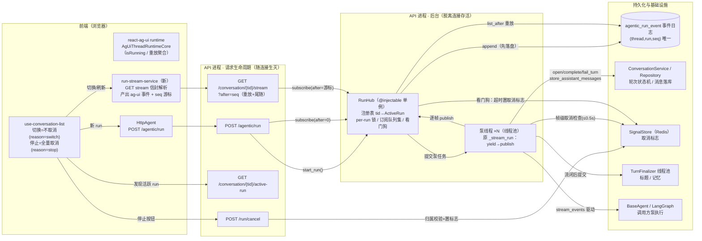
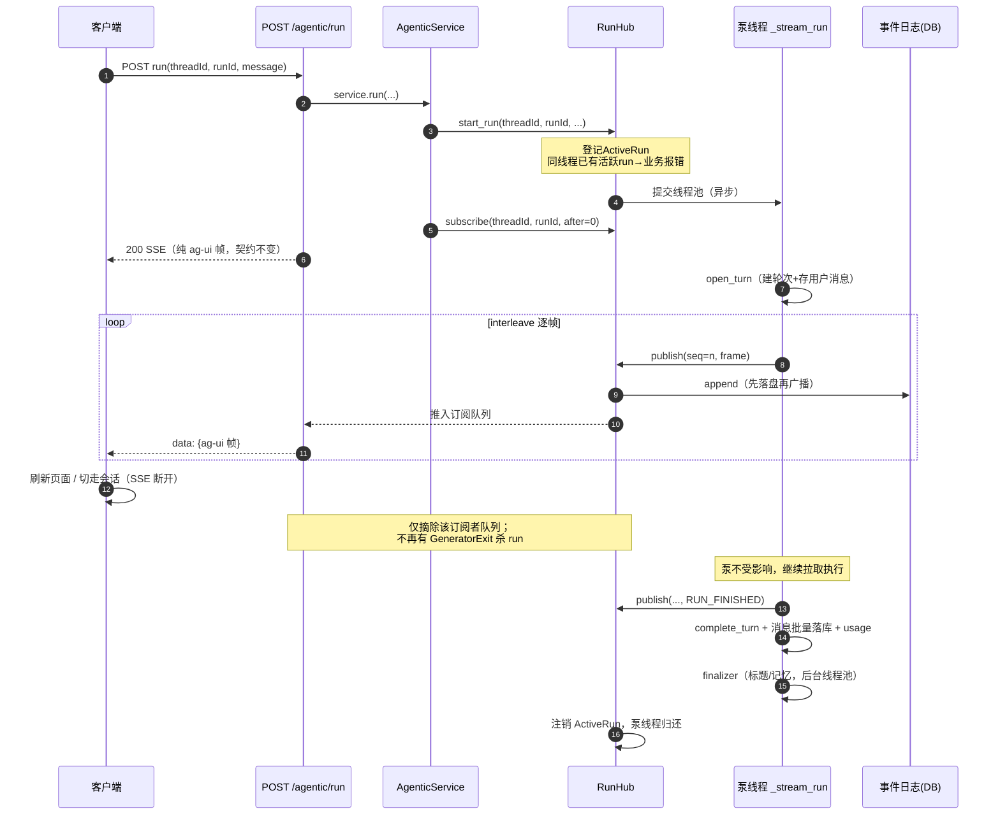
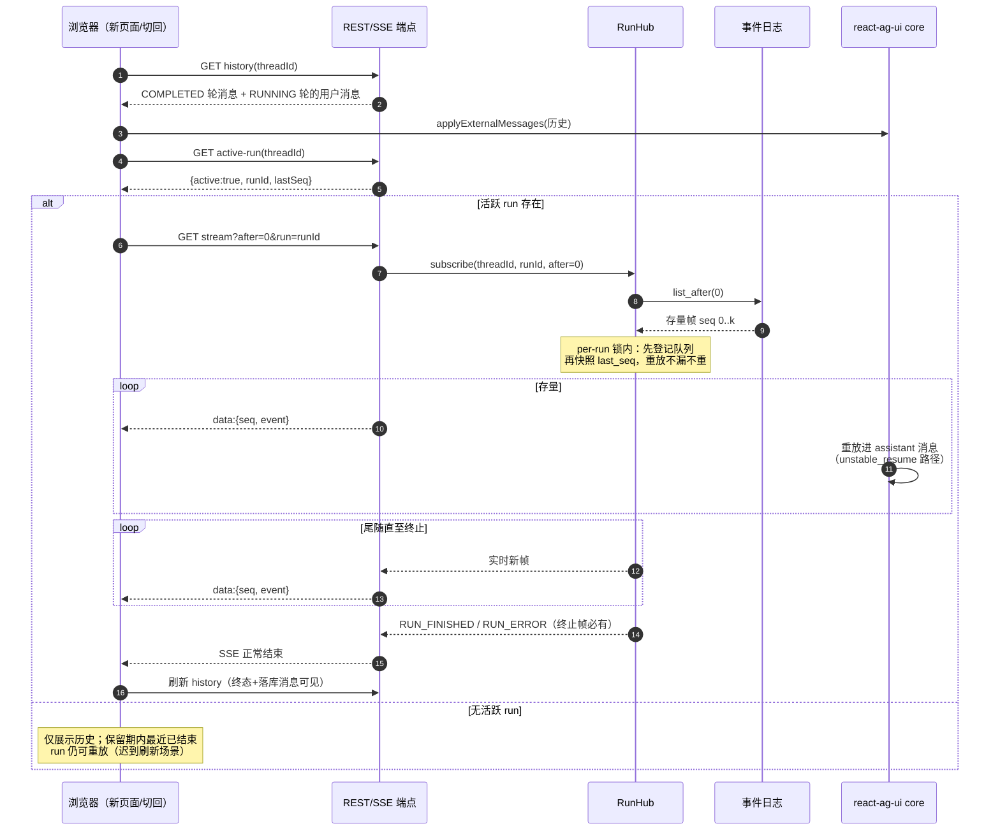
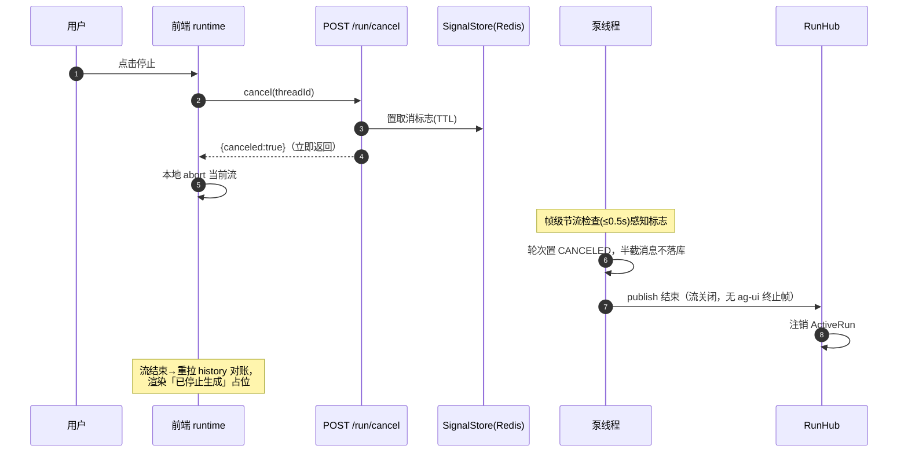
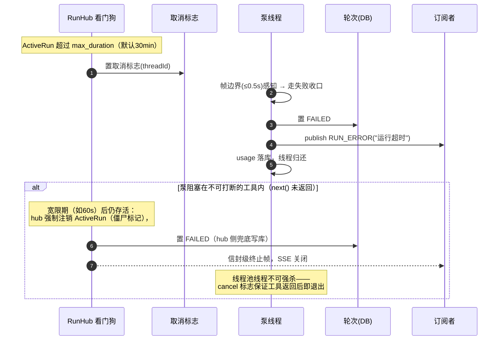
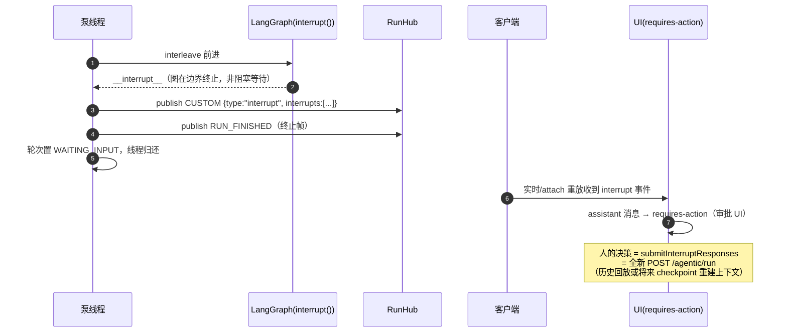

# SSE 断流改造设计：服务端保持 run + 断线 attach 续看

> 配套调研结论见会话记录。本文以对象交互图 + 时序图确认流程；实现顺序与范围见
> 会话中已确认的方案（进程内后台执行 + 后端前端全链路）。

## 一、对象交互图（组件与归属边界）

核心：**泵线程与订阅连接分属两个生命周期**——HTTP 请求侧只做「发起 run / 订阅
事件流」，泵在后台存活，事件日志是两者的唯一交汇点。

职责要点：

- **RunHub** 是唯一的「run 存活」注册表：登记/注销 ActiveRun、per-run 锁保证
  「重放→尾随」无缺口、看门狗强制终止帧、同线程单活跃 run 守卫。
- **泵线程**持有原 `_stream_run` 全部业务语义（open_turn、双翻译器、取消检查、
  落库、finalizer）；断连不再出现在它的世界里。
- **事件日志**是请求侧与后台侧的唯一交汇：先落盘再广播；订阅端点读它重放。

## 二、时序 1：发起 run + 中途断连（run 存活跑完）

不变量：断连只影响「订阅者集合」；轮次终态、消息落库、finalizer 与客户端
是否在场完全解耦。

## 三、时序 2：刷新/切回后 attach 续看（存量重放 + 实时尾随）

前端侧：`use-conversation-list` 切换时不再 cancel；attach 后 isRunning 恢复、
停止按钮可用（REST cancel 照常生效）。

## 四、时序 3：用户主动停止（唯一取消通道，语义不变）

与现状的差别仅在：取消必须显式发生（stop 按钮或 REST），断连不再隐式取消。
订阅侧终止表达 = SSE 流结束 + 历史终态对账（ag-ui 无服务端 CANCELLED 事件，
口径与现网一致）。

## 五、时序 4：看门狗强制终止（防失控/防 HITL 卡死）

与 per-user 并发上限共同保证：线程池不会被悬挂 run 耗尽；任何 run 必有终点。

## 六、时序 5：未来 HITL interrupt（本期仅预留，验证「不卡泵」契约）

契约要点：**泵线程永远不等人工输入**——interrupt 是 run 的终止边界，人的决策
以新 run 请求到达。看门狗（时序 4）兜住「工具内部长轮询审批」这类例外。

## 七、流程不变量清单（评审用）

1. **先落盘再广播**：崩溃最多丢实时广播，不丢事件序；重放以 DB 为准。
2. **重放无缺口**：subscribe 在 per-run 锁内「登记队列 → 快照 last_seq → 读
   日志 → 尾随」；订阅方按 seq 去重兜底。
3. **终止帧必有**：RUN_FINISHED / RUN_ERROR 必达订阅者（cancel 路径 = 流结束 +
   历史终态对账）；看门狗强制超时 run 收口。
4. **断连 ≠ 取消**：断连只摘订阅者；取消只有显式通道（stop / REST / 看门狗）。
5. **run 有限契约**：每次 run 有限时长、有限输出、释放泵线程；人工输入以新
   run 到达。
6. **POST /agentic/run 契约字节级不变**：发起方与重放订阅方是两种消费形态。
